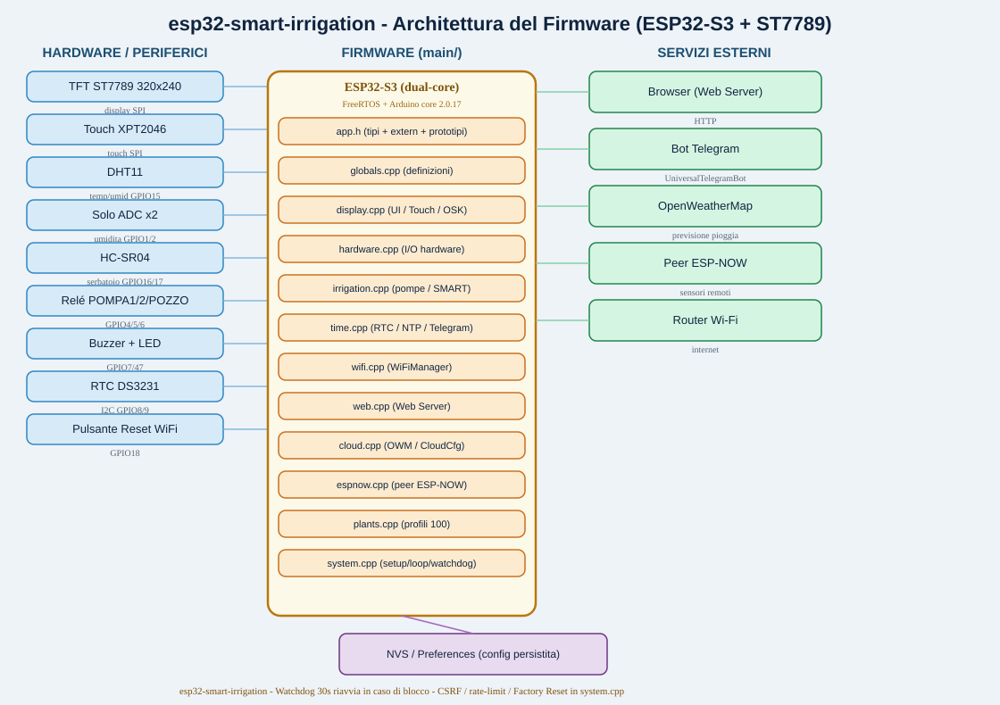

# ESP32 Smart Irrigation

## Sistema di irrigazione IoT intelligente

Sistema di controllo dell'irrigazione sviluppato su **ESP32-S3**, che integra elettronica embedded, sensori, automazione, connettività remota e un'interfaccia touch interattiva.

Il progetto è stato sviluppato come un sistema IoT completo, in grado di monitorare le condizioni del terreno e dell'ambiente, controllare le pompe di irrigazione e adattare i cicli di irrigazione in base ai dati rilevati e alle informazioni meteorologiche.

> **Nota:** il codice sorgente non è incluso in questo repository. Il repository è stato creato come **portfolio tecnico** e documentazione del progetto.

---

## Panoramica del progetto

Il sistema integra controllo hardware, firmware embedded e connettività IoT in un'unica piattaforma per la gestione automatizzata dell'irrigazione.

Il controller gestisce:

* 💧 Pompe di irrigazione automatiche
* 🌱 Monitoraggio dell'umidità del terreno
* 🌡️ Temperatura e umidità ambientale
* 🚰 Monitoraggio del livello del serbatoio
* 🖥️ Interfaccia TFT touch
* 📡 Connettività Wi-Fi
* 🌐 Web Server integrato
* 📱 Controllo remoto e notifiche tramite Telegram
* 🔗 Comunicazione ESP-NOW
* ☁️ Integrazione con OpenWeatherMap
* 🔄 Aggiornamento firmware OTA
* 🤖 Logica SMART adattiva per l'irrigazione
* 🛡️ Watchdog e meccanismi di sicurezza

---

## Punti di forza tecnici

| Area | Implementazione |
|---|---|
| MCU | ESP32-S3 Dual-Core |
| Firmware | C++ modulare / Arduino |
| Sistema real-time | FreeRTOS |
| Display | ST7789 320×240 |
| Touch | XPT2046 |
| Sensori | Umidità del terreno / DHT11 / HC-SR04 |
| Comunicazione | Wi-Fi / ESP-NOW |
| Controllo remoto | Web Server / Telegram |
| Cloud | OpenWeatherMap |
| Memoria | NVS / Preferences |
| Aggiornamenti | OTA |
| Sicurezza | SHA-256 / CSRF / Rate Limiting |
| Affidabilità | Hardware Watchdog |
| Logica di controllo | Automatica / Manuale / SMART |

## Hardware

### Controller principale

* ESP32-S3
* Display TFT ST7789 — 320×240
* Touch resistivo XPT2046
* RTC DS3231

### Sensori

* 2× sensori di umidità del terreno
* Sensore DHT11 per temperatura e umidità
* Sensore ultrasonico HC-SR04 per il livello dell'acqua

### Attuatori

* 2× pompe di irrigazione
* 1× relè per il pozzo
* Buzzer
* LED di stato

---

## Software e tecnologie

* **C++**
* **Arduino**
* **ESP32-S3**
* **FreeRTOS**
* **Wi-Fi**
* **ESP-NOW**
* **HTTP / Web Server**
* **Telegram Bot API**
* **OpenWeatherMap API**
* **OTA Firmware Update**
* **NVS / Preferences**
* **JSON**
* **Watchdog**
* **SHA-256**
* **CSRF Protection**
* **Rate Limiting**

---

## Irrigazione SMART

Una delle caratteristiche principali del progetto è la modalità **SMART**, progettata per rendere la gestione dell'irrigazione più adattiva.

Il controller analizza la relazione tra:

* tempo di funzionamento della pompa;
* umidità del terreno prima dell'irrigazione;
* umidità del terreno dopo l'irrigazione.

Sulla base dei dati raccolti, il sistema può adattare la durata dei cicli di irrigazione, cercando di migliorare l'efficienza nell'utilizzo dell'acqua.

La logica SMART può inoltre utilizzare le informazioni meteorologiche provenienti da **OpenWeatherMap** per sospendere automaticamente l'irrigazione quando è prevista pioggia.

---

## Interfaccia utente

Il controller dispone di un'interfaccia grafica touch sviluppata per il display **ST7789 320×240**.

Le principali schermate includono:

* Home
* Acqua / Serbatoio
* Rete
* Meteo
* SMART / AI
* Programmazione
* Impostazioni

L'interfaccia comprende inoltre:

* elementi grafici e animazioni;
* navigazione tramite touch;
* gesture swipe;
* pulsanti touch;
* schermate di allarme;
* tastiera virtuale;
* visualizzazione dello stato del sistema.

---

## Controllo remoto

Il sistema supporta diverse modalità di comunicazione e controllo remoto.

### Web Server

Il Web Server embedded permette di monitorare e configurare il dispositivo direttamente tramite browser.

Le principali funzioni includono:

* visualizzazione dello stato del sistema;
* controllo manuale delle pompe;
* programmazione dell'irrigazione;
* configurazione Wi-Fi;
* calibrazione dei sensori;
* gestione dei profili delle piante;
* configurazione della modalità SMART;
* configurazione meteorologica;
* gestione dei log;
* aggiornamento firmware OTA;
* configurazione e reset del sistema.

### Telegram

L'integrazione con Telegram permette di ricevere notifiche e inviare comandi al sistema da remoto.

### ESP-NOW

ESP-NOW viene utilizzato per la comunicazione con sensori e dispositivi ESP remoti, permettendo di estendere il sistema con nodi distribuiti.

---

## Affidabilità e sicurezza

Il firmware integra diversi meccanismi progettati per migliorare l'affidabilità e la sicurezza del sistema:

* Hardware Watchdog
* Accesso protetto tramite password
* Hashing della password con SHA-256
* Protezione CSRF
* Rate Limiting
* Protezione degli aggiornamenti OTA
* Factory Reset
* Configurazioni persistenti tramite NVS
* Gestione delle condizioni anomale del sistema

---

## Architettura



Il firmware è stato inizialmente sviluppato come uno sketch monolitico di grandi dimensioni.

Con l'evoluzione del progetto, l'architettura software è stata riorganizzata in moduli funzionali, separando le principali responsabilità del sistema.

```text
                    ESP32-S3
                       │
        ┌──────────────┼──────────────┐
        │              │              │
     Sensori        Attuatori      Interfaccia
        │              │              │
   Suolo / DHT11   Pompe / Relè    ST7789 + Touch
   HC-SR04         Buzzer / LED
        │
        └──────────────┬──────────────┘
                       │
                  Logica di controllo
                       │
              ┌────────┼────────┐
              │        │        │
             Wi-Fi   Telegram  ESP-NOW
              │
        OpenWeatherMap
              │
          SMART Logic
```

Per una descrizione completa dell'architettura software, dei flussi di dati e delle interazioni tra i moduli:

➡️ **[Visualizza la documentazione completa dell'architettura](docs/ARCHITECTURE.md)**

---

## Principali aree tecniche

Il progetto dimostra esperienza pratica nelle seguenti aree:

* Sviluppo di sistemi embedded
* Programmazione di microcontrollori
* Programmazione C++
* Integrazione hardware e software
* Acquisizione dati da sensori
* Controllo di attuatori
* Comunicazione SPI e I²C
* Letture ADC e calibrazione dei sensori
* Networking Wi-Fi
* Comunicazione IoT
* Web Server embedded
* Interfacce grafiche touch
* Comunicazione ESP-NOW
* Gestione remota dei dispositivi
* Aggiornamenti firmware OTA
* Gestione di task real-time
* Sicurezza embedded
* Diagnostica del sistema
* Automazione
* Integrazione hardware/software

---

## Architettura hardware e software

Il sistema segue una struttura a più livelli:

```text
┌───────────────────────────────────────┐
│             USER INTERFACE            │
│        TFT Touch / Web / Telegram     │
└───────────────────┬───────────────────┘
                    │
┌───────────────────▼───────────────────┐
│          CONTROL & SMART LOGIC        │
│     Irrigation / Scheduling / AI      │
└───────────────────┬───────────────────┘
                    │
┌───────────────────▼───────────────────┐
│          SENSOR / HARDWARE            │
│ Soil / DHT11 / HC-SR04 / RTC / Relays│
└───────────────────┬───────────────────┘
                    │
┌───────────────────▼───────────────────┐
│              ESP32-S3                 │
│        Embedded Control Platform      │
└───────────────────────────────────────┘
```

Questa separazione permette di mantenere distinti acquisizione dati, logica di controllo, interfaccia utente e comunicazione, facilitando manutenzione ed evoluzione del sistema.

---

## Project Status

**Piattaforma:** ESP32-S3
**Display:** ST7789 320×240
**Touch:** XPT2046
**Ambiente di sviluppo:** Arduino IDE
**Firmware:** C++
**Architettura:** Firmware modulare
**Tipologia:** Embedded / IoT / Automazione

---

## Obiettivo del progetto

Il progetto è stato sviluppato come applicazione pratica di **sistemi embedded, automazione ed IoT**, combinando elettronica e sviluppo firmware in un'unica piattaforma.

L'obiettivo è realizzare un sistema di irrigazione capace non solo di eseguire comandi predefiniti, ma anche di:

* acquisire dati dal campo;
* prendere decisioni in base alle condizioni rilevate;
* controllare autonomamente gli attuatori;
* comunicare con dispositivi remoti;
* fornire interfacce locali e remote;
* utilizzare dati meteorologici;
* adattare il comportamento dell'irrigazione;
* mantenere configurazioni e parametri nel tempo.

---

## Portfolio tecnico

Questo repository rappresenta una sintesi delle competenze applicate nello sviluppo del progetto, tra cui **elettronica, firmware embedded, automazione, IoT, networking, interfacce utente e integrazione hardware/software**.

Il codice sorgente non viene pubblicato; la documentazione è fornita per illustrare l'architettura, le funzionalità e le principali scelte tecniche del sistema.
