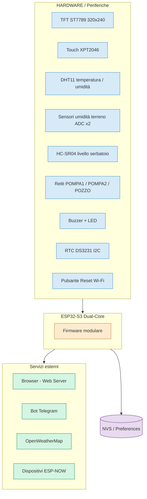
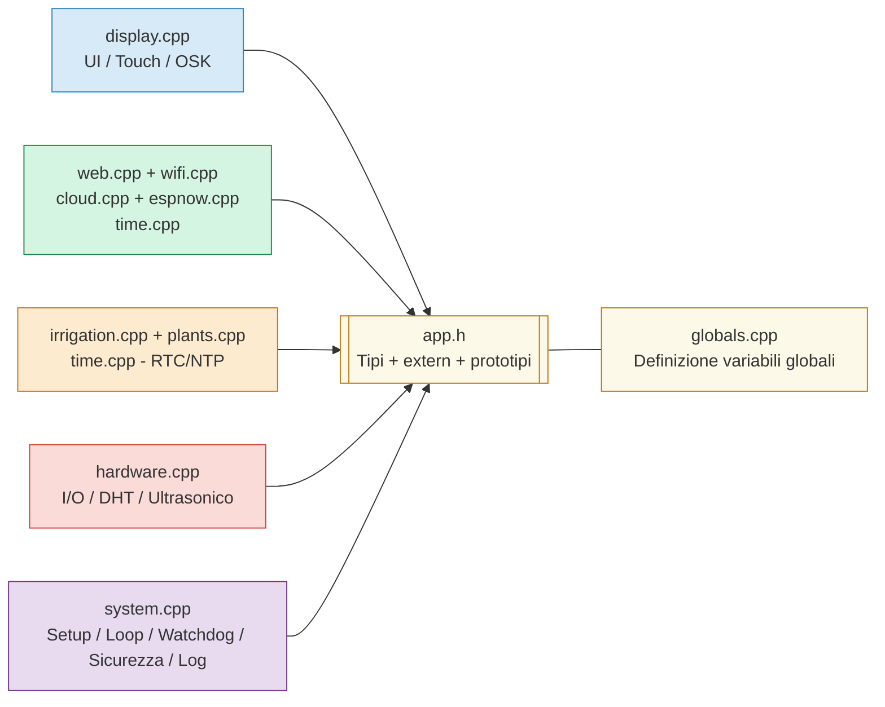
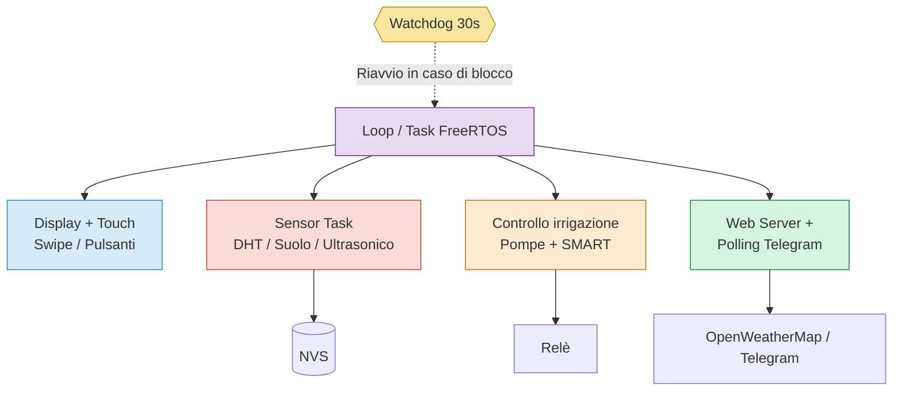
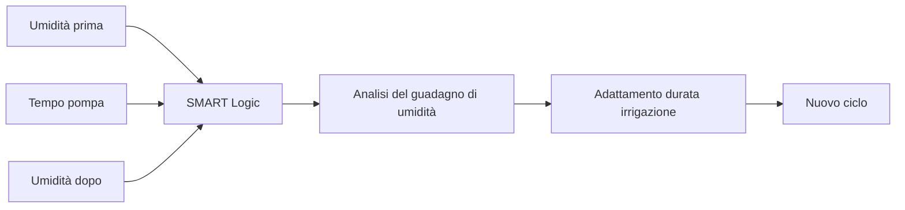
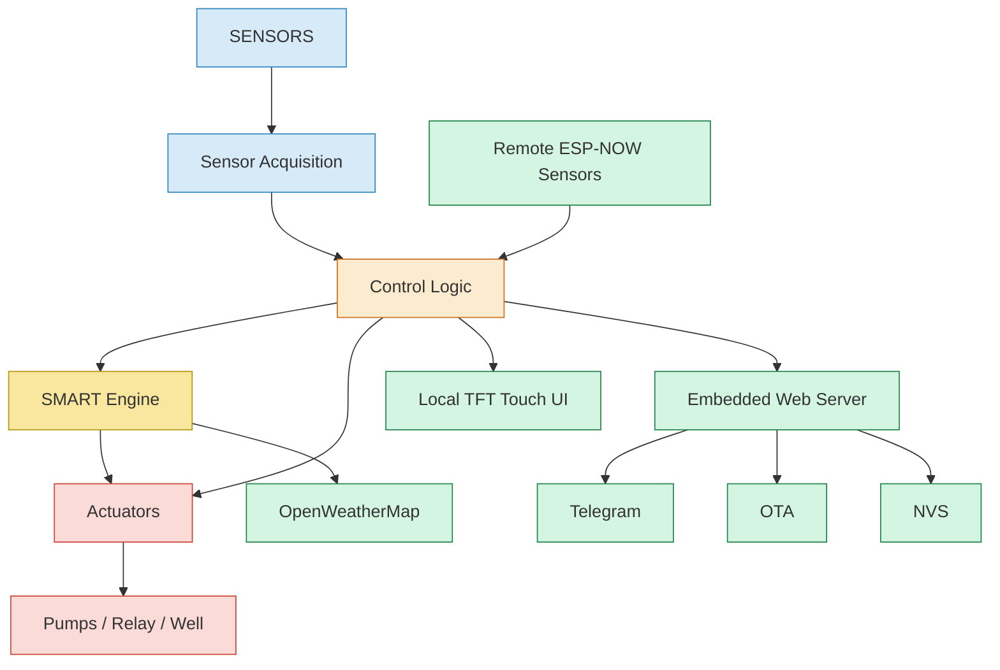

# Architettura del Sistema — ESP32-S3 Smart Irrigation

Documentazione tecnica dell'architettura del sistema di irrigazione intelligente basato su **ESP32-S3**, display TFT touch ST7789 e firmware modulare.

Il sistema integra hardware embedded, gestione dei sensori, controllo degli attuatori, interfaccia utente locale, connettività di rete, comunicazione remota e logica adattiva per la gestione dell'irrigazione.

---

## 1. Vista di implementazione — Contesto del sistema



Il sistema è organizzato attorno all'**ESP32-S3**, che funge da unità centrale di elaborazione e controllo.

L'ESP32-S3 comunica con:

* sensori ambientali e del terreno;
* display TFT e touch screen;
* relè e attuatori;
* RTC;
* dispositivi remoti tramite ESP-NOW;
* rete Wi-Fi;
* servizi cloud;
* browser tramite Web Server;
* Telegram tramite Bot API.

Le configurazioni e alcuni parametri operativi vengono mantenuti nella memoria **NVS (Non-Volatile Storage)**.

---

# 2. Architettura software

Il firmware è stato organizzato in moduli funzionali per separare le responsabilità e semplificare manutenzione, debug ed evoluzione del sistema.



### Moduli principali

| Modulo           | Responsabilità                                                         |
| ---------------- | ---------------------------------------------------------------------- |
| `display.cpp`    | Interfaccia grafica, touch, animazioni, schermate e tastiera virtuale  |
| `hardware.cpp`   | Gestione I/O, relè, buzzer, LED, DHT11 e sensore ultrasonico           |
| `irrigation.cpp` | Logica di irrigazione, pompe, programmazione, sensori e modalità SMART |
| `time.cpp`       | RTC, NTP, gestione dell'orologio e funzioni correlate                  |
| `wifi.cpp`       | Gestione Wi-Fi e WiFiManager                                           |
| `web.cpp`        | Web Server embedded e API HTTP                                         |
| `cloud.cpp`      | OpenWeatherMap e configurazioni cloud                                  |
| `espnow.cpp`     | Comunicazione ESP-NOW con dispositivi remoti                           |
| `plants.cpp`     | Gestione dei profili delle piante                                      |
| `system.cpp`     | Watchdog, sicurezza, log, reset e funzioni di sistema                  |
| `app.h`          | Tipi globali, costanti, `extern` e prototipi                           |
| `globals.cpp`    | Istanziazione delle variabili globali                                  |

### `app.h`

`app.h` funge da header comune dell'architettura software.

Contiene:

* `#include`;
* costanti e `#define`;
* strutture dati globali;
* dichiarazioni `extern`;
* prototipi delle funzioni.

Le variabili globali vengono istanziate una sola volta in `globals.cpp`.

Questa organizzazione evita definizioni duplicate e permette ai diversi moduli di condividere in modo controllato lo stato del sistema.

---

# 3. Attività runtime e FreeRTOS

Il firmware utilizza il modello di esecuzione dell'ESP32-S3 e le funzionalità di **FreeRTOS** per organizzare le attività del sistema.



Le principali attività runtime comprendono:

* gestione dell'interfaccia utente;
* acquisizione dei sensori;
* controllo delle pompe;
* gestione della modalità SMART;
* Web Server;
* comunicazione Telegram;
* aggiornamento delle informazioni meteorologiche;
* gestione del watchdog.

Il **watchdog di 30 secondi** viene utilizzato come meccanismo di protezione contro eventuali blocchi del firmware.

---

# 4. Flusso hardware e comunicazione

```text
+-----------------------------+
| HARDWARE / PERIFERICHE      |
+-----------------------------+
| TFT ST7789 320x240 (SPI)    |
| Touch XPT2046 (SPI)         |
| DHT11 (GPIO15)              |
| Sensori terreno ADC x2      |
| HC-SR04 (GPIO16/17)         |
| Relè POMPA1/2/POZZO         |
| Buzzer + LED                |
| RTC DS3231 (I2C)            |
| Pulsante Reset Wi-Fi        |
+--------------+--------------+
               |
               v
+----------------------------------------+
| ESP32-S3                               |
|                                        |
|  display.cpp   → UI / Touch / OSK      |
|  hardware.cpp  → I/O / Sensori         |
|  irrigation.cpp → Pompe / SMART        |
|  time.cpp      → RTC / NTP             |
|  wifi.cpp      → Wi-Fi                 |
|  web.cpp       → Web Server            |
|  cloud.cpp     → OpenWeatherMap        |
|  espnow.cpp    → ESP-NOW               |
|  plants.cpp    → Profili piante        |
|  system.cpp    → Sistema / Sicurezza   |
|                                        |
|  app.h         → Tipi / API interne    |
|  globals.cpp   → Variabili globali     |
+-------------------+--------------------+
                    |
          +---------+---------+
          |         |         |
          v         v         v
      Browser   Telegram   ESP-NOW
       / Web     / Bot      / Peer
          |
          v
   OpenWeatherMap
          |
          v
   NVS / Preferences
```

---

# 5. Flusso dei dati

Il funzionamento generale del sistema può essere rappresentato attraverso il seguente flusso:

```text
Sensori
   │
   ├── Umidità terreno
   ├── Temperatura / Umidità
   ├── Livello serbatoio
   └── RTC
   │
   ▼
Acquisizione dati
   │
   ▼
Logica di controllo
   │
   ├── Programmazione
   ├── Modalità automatica
   ├── Modalità manuale
   └── SMART
   │
   ▼
Decisione irrigazione
   │
   ├── Condizioni OK ──────► Pompe / Pozzo
   │
   └── Pioggia prevista ───► Sospensione
```

Il sistema utilizza i dati provenienti dai sensori per determinare lo stato dell'impianto e decidere se avviare o modificare un ciclo di irrigazione.

---

# 6. Modalità SMART

La modalità **SMART** rappresenta uno degli elementi principali dell'architettura software.

Il sistema analizza la relazione tra:

* durata del funzionamento della pompa;
* umidità del terreno prima dell'irrigazione;
* umidità del terreno dopo l'irrigazione;
* variazione dell'umidità ottenuta.



L'obiettivo è rendere il sistema progressivamente più adattivo, evitando di utilizzare esclusivamente tempi di irrigazione fissi.

La configurazione e i parametri appresi vengono mantenuti nella memoria NVS.

La modalità SMART può inoltre utilizzare le informazioni meteorologiche provenienti da **OpenWeatherMap** per sospendere un ciclo automatico quando viene prevista pioggia.

---

# 7. Interfaccia utente

Il sistema dispone di un'interfaccia grafica sviluppata per il display **ST7789 320×240** con touch resistivo **XPT2046**.

Le principali schermate comprendono:

* Home;
* Acqua / Serbatoio;
* Rete;
* Meteo;
* SMART / AI;
* Programmazione;
* Impostazioni.

L'interfaccia comprende inoltre:

* navigazione tramite touch;
* gesture swipe;
* pulsanti touch;
* animazioni;
* schermate di allarme;
* tastiera virtuale;
* informazioni sullo stato del sistema.

---

# 8. Web Server

Il Web Server embedded permette di accedere al sistema tramite browser utilizzando la rete Wi-Fi.

Le principali funzioni comprendono:

* monitoraggio dello stato;
* controllo manuale delle pompe;
* configurazione dell'irrigazione;
* gestione della programmazione;
* configurazione Wi-Fi;
* calibrazione dei sensori;
* gestione dei profili delle piante;
* configurazione SMART;
* configurazione meteo;
* gestione dei log;
* aggiornamento OTA;
* reset e configurazione del sistema.

Il Web Server costituisce quindi una seconda interfaccia di controllo oltre al display locale.

---

# 9. Connettività

## Wi-Fi

La connessione Wi-Fi viene gestita tramite **WiFiManager**, con possibilità di configurazione tramite captive portal.

Il sistema supporta inoltre il reset delle credenziali Wi-Fi tramite pulsante dedicato.

## Telegram

L'integrazione Telegram permette:

* notifiche remote;
* monitoraggio;
* invio di comandi;
* comunicazione con il dispositivo senza accesso diretto al display.

## ESP-NOW

ESP-NOW viene utilizzato per la comunicazione diretta tra l'ESP32-S3 e dispositivi ESP remoti.

Questo permette di estendere il sistema con sensori o nodi distribuiti senza richiedere necessariamente una connessione IP tra i dispositivi.

## OpenWeatherMap

L'integrazione con OpenWeatherMap permette di ottenere informazioni meteorologiche utilizzate dalla logica di irrigazione.

In particolare, la previsione di pioggia può causare la sospensione automatica dell'irrigazione.

---

# 10. Memoria persistente

Il sistema utilizza **NVS / Preferences** per mantenere le configurazioni anche dopo il riavvio o la perdita di alimentazione.

Possono essere memorizzati, tra gli altri:

* calibrazione dei sensori;
* configurazioni Wi-Fi;
* configurazioni cloud;
* impostazioni Telegram;
* configurazioni meteorologiche;
* parametri SMART;
* programmazioni;
* configurazioni del sistema.

---

# 11. Sicurezza e affidabilità

L'architettura comprende diversi meccanismi per migliorare la sicurezza e l'affidabilità del dispositivo.

### Sicurezza

* autenticazione tramite password;
* hash SHA-256;
* protezione CSRF;
* rate limiting;
* protezione delle operazioni sensibili;
* protezione dell'aggiornamento OTA.

### Affidabilità

* watchdog hardware;
* gestione degli errori;
* factory reset;
* configurazioni persistenti;
* monitoraggio dello stato dei sensori;
* gestione delle condizioni anomale del serbatoio.

---

# 12. OTA — Over The Air Update

Il firmware supporta l'aggiornamento **OTA (Over The Air)** tramite il Web Server.

Il processo permette di:

1. accedere alla pagina OTA;
2. autenticarsi;
3. caricare il nuovo firmware;
4. scrivere il firmware nella partizione di aggiornamento;
5. riavviare il dispositivo con la nuova versione.

Questo permette di aggiornare il firmware senza collegare fisicamente l'ESP32-S3 al computer.

---

# 13. Gestione degli attuatori

L'ESP32-S3 controlla:

* **POMPA1**
* **POMPA2**
* **RELE_POZZO**
* buzzer
* LED di stato

La logica di controllo considera le condizioni del sistema prima dell'attivazione delle pompe.

Tra le condizioni gestite:

* modalità automatica/manuale;
* programmazione;
* umidità del terreno;
* livello del serbatoio;
* previsione di pioggia;
* sospensione di emergenza;
* modalità SMART.

---

# 14. Architettura complessiva



L'architettura complessiva separa chiaramente:

**Acquisizione → Elaborazione → Decisione → Azionamento → Monitoraggio**

permettendo al sistema di integrare hardware, firmware e servizi di rete all'interno di un'unica piattaforma embedded.

---

# 15. Struttura concettuale del progetto

```text
ESP32-S3 Smart Irrigation
│
├── Hardware Layer
│   ├── Sensors
│   ├── Actuators
│   ├── Display
│   └── RTC
│
├── Firmware Layer
│   ├── Hardware Management
│   ├── Irrigation Control
│   ├── SMART Logic
│   ├── Time Management
│   └── System Management
│
├── Interface Layer
│   ├── TFT Touch UI
│   └── Web Server
│
├── Communication Layer
│   ├── Wi-Fi
│   ├── Telegram
│   ├── ESP-NOW
│   └── OpenWeatherMap
│
└── System Services
    ├── NVS
    ├── OTA
    ├── Watchdog
    ├── Security
    └── Logging
```

---

## 16. Sintesi tecnica

Il progetto rappresenta un sistema embedded completo che integra **elettronica, firmware, automazione e IoT**.

Le principali aree tecniche coinvolte sono:

* programmazione embedded in C++;
* ESP32-S3;
* gestione sensori e attuatori;
* ADC e calibrazione;
* comunicazione SPI e I²C;
* display e interfacce touch;
* Wi-Fi e protocolli wireless;
* Web Server embedded;
* comunicazione ESP-NOW;
* API e servizi cloud;
* Telegram Bot;
* OTA;
* FreeRTOS;
* memoria non volatile;
* sicurezza embedded;
* watchdog e gestione degli errori;
* logica di automazione adattiva.

Il progetto è stato sviluppato con particolare attenzione alla **modularità del firmware**, alla separazione delle responsabilità e alla possibilità di estendere il sistema con nuove funzionalità e dispositivi.

