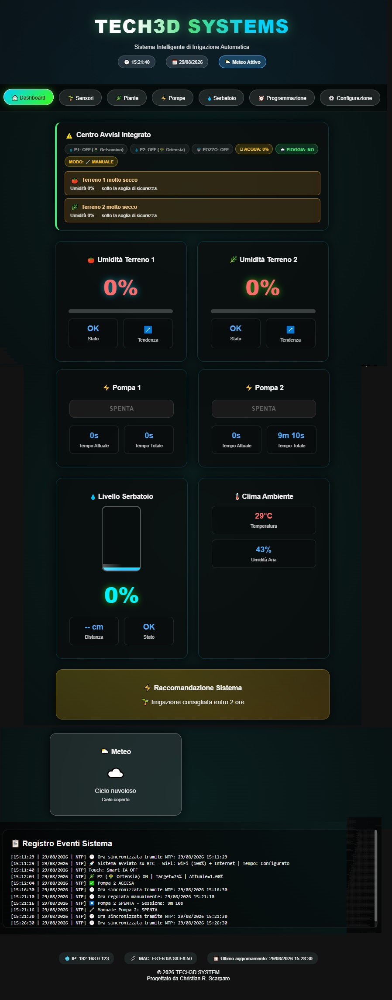
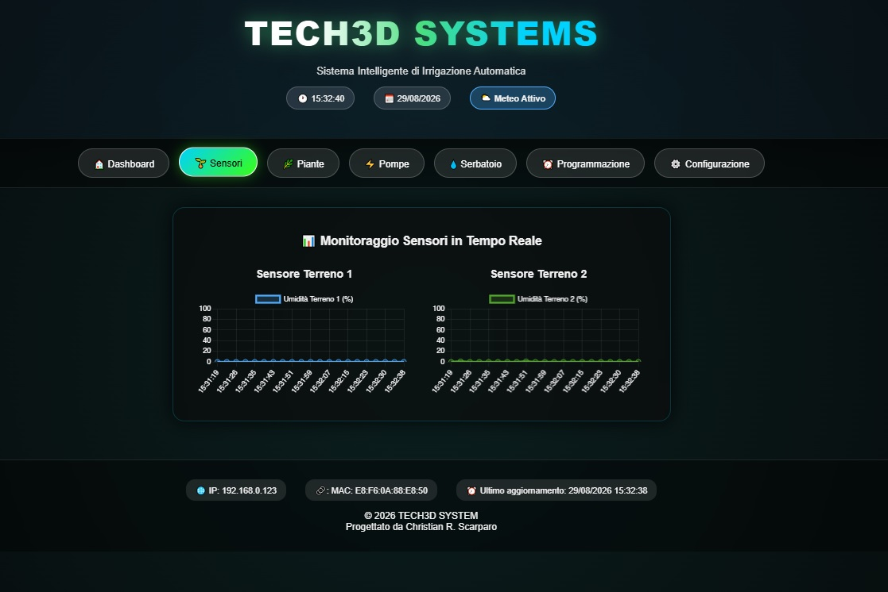
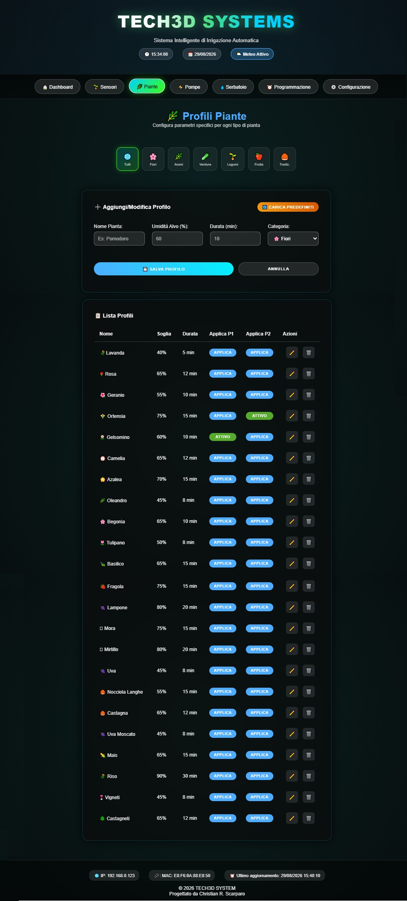
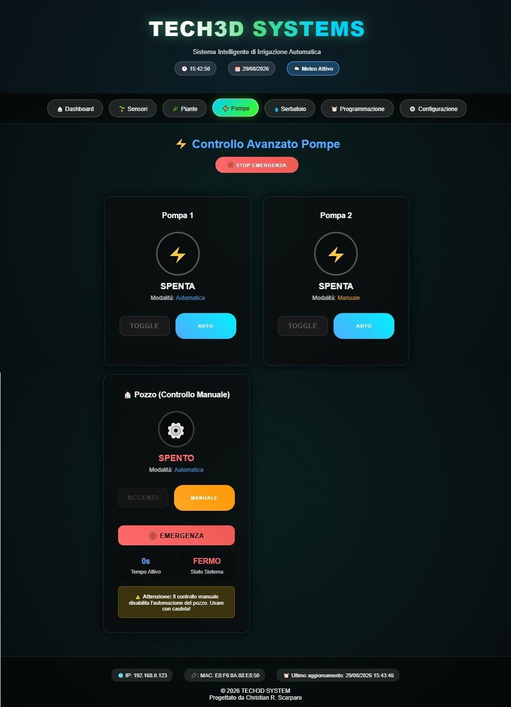
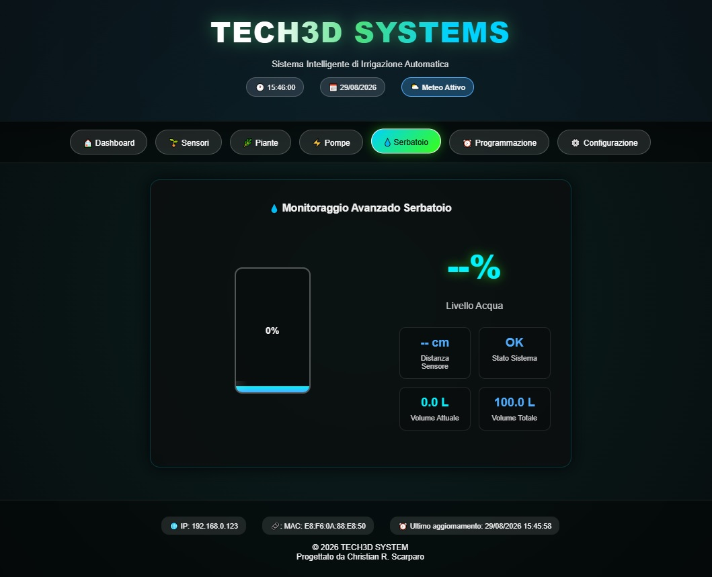
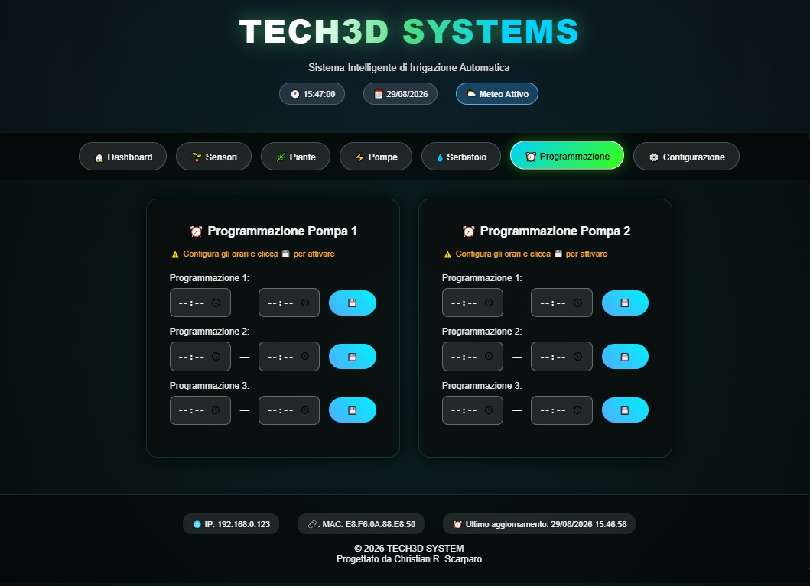
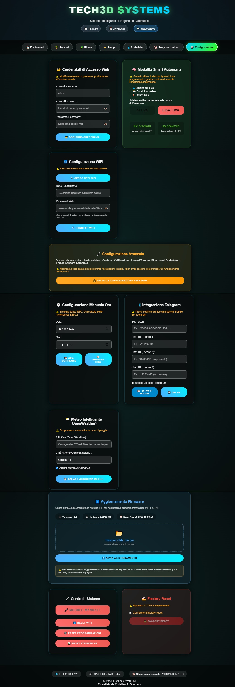

# Documentazione Tecnica — ESP32 Smart Irrigation

## 1. Panoramica del progetto

**ESP32 Smart Irrigation** è un prototipo funzionale di sistema IoT per il controllo e la gestione automatizzata dell'irrigazione, sviluppato attorno a un microcontrollore **ESP32-S3**.

Il progetto integra elettronica embedded, acquisizione dati da sensori, controllo di attuatori, interfaccia grafica touch, connettività di rete e logiche automatiche per la gestione dell'irrigazione.

L'obiettivo è realizzare un sistema capace di:

* monitorare l'umidità del terreno;
* controllare automaticamente le pompe di irrigazione;
* monitorare il livello dell'acqua nel serbatoio;
* acquisire temperatura e umidità ambientale;
* gestire programmi di irrigazione;
* fornire un'interfaccia locale tramite display touch;
* consentire il controllo remoto tramite Web Server e Telegram;
* comunicare con dispositivi remoti tramite ESP-NOW;
* utilizzare informazioni meteorologiche per supportare le decisioni di irrigazione;
* aggiornare il firmware tramite OTA;
* adattare la durata dell'irrigazione attraverso una logica SMART basata sul feedback dei sensori.

> **Nota:** il codice sorgente completo non è incluso nel repository. Il progetto è pubblicato come **portfolio tecnico**, con l'obiettivo di documentare architettura, hardware, firmware, funzionalità e soluzioni tecniche adottate durante lo sviluppo.

---

# 2. Tipologia del progetto

Il sistema è stato sviluppato come **prototipo funzionale di ingegneria elettronica ed embedded**.

Il prototipo comprende sia la parte elettronica sia quella meccanica.

La realizzazione hardware utilizza:

* ESP32-S3 come controller principale;
* scheda prototipale millefori;
* socket per il montaggio rimovibile dell'ESP32-S3;
* connettori JST HX;
* terminal block per le connessioni esterne;
* cablaggio organizzato per facilitare manutenzione e sostituzione dei componenti;
* contenitore commerciale IP65 adattato al progetto;
* supporto e cornice per il display realizzati tramite stampa 3D.

L'obiettivo della realizzazione prototipale è verificare il funzionamento dell'architettura hardware/software prima di un'eventuale progettazione di una PCB dedicata per produzione.

---

# 3. Architettura del sistema

Il sistema è organizzato in tre livelli principali:

1. **Hardware e periferiche**
2. **Firmware embedded ESP32-S3**
3. **Servizi e dispositivi esterni**

L'ESP32-S3 rappresenta il nodo centrale del sistema e coordina l'acquisizione dei dati, la logica di controllo, l'interfaccia utente e le comunicazioni.

```text
                    ┌─────────────────────────┐
                    │       ESP32-S3          │
                    │    Controller centrale  │
                    └────────────┬────────────┘
                                 │
              ┌──────────────────┼──────────────────┐
              │                  │                  │
              ▼                  ▼                  ▼
        Sensori / I/O       Interfaccia         Networking
              │              ST7789/XPT2046          │
              │                  │          ┌────────┼────────┐
              │                  │          │        │        │
              ▼                  ▼          ▼        ▼        ▼
       Terreno / DHT11       Display      Wi-Fi  Telegram  ESP-NOW
       HC-SR04 / RTC                                     
```

---

# 4. Hardware e periferiche

## 4.1 Controller

Il controller principale è un **ESP32-S3 Dual-Core**, responsabile dell'esecuzione del firmware e della gestione delle periferiche.

Il microcontrollore coordina:

* acquisizione dei sensori;
* controllo degli attuatori;
* interfaccia grafica;
* gestione Wi-Fi;
* Web Server;
* Telegram;
* ESP-NOW;
* logica automatica;
* modalità SMART;
* configurazione persistente;
* sicurezza;
* watchdog;
* aggiornamento OTA.

---

## 4.2 Display e interfaccia touch

Il sistema utilizza:

* display TFT **ST7789 320×240**;
* touch resistivo **XPT2046**.

Il display viene utilizzato come interfaccia locale per:

* visualizzazione dello stato del sistema;
* monitoraggio dei sensori;
* gestione delle pompe;
* configurazione;
* programmazione;
* visualizzazione del meteo;
* gestione della modalità SMART;
* visualizzazione di allarmi ed eventi.

---

# 5. Prototipazione elettronica

La parte elettronica è stata realizzata utilizzando una **scheda prototipale millefori**, scelta per permettere modifiche e verifiche durante lo sviluppo.

L'ESP32-S3 è montato tramite **socket**, consentendo di rimuovere e sostituire il modulo senza dover intervenire direttamente sulle connessioni della scheda prototipale.

Questa soluzione facilita:

* manutenzione;
* sostituzione del controller;
* debugging;
* modifica dei collegamenti;
* sviluppo iterativo;
* riutilizzo della piattaforma hardware.

### Connettori

Per il cablaggio sono stati utilizzati:

* **JST HX** per le connessioni interne;
* **Terminal Block (TERM BLK)** per le connessioni esterne verso sensori e attuatori.

La separazione tramite connettori rende il cablaggio più ordinato e permette di scollegare singoli moduli durante le operazioni di manutenzione o test.

> La scheda utilizzata è una **prototipazione funzionale** e non una PCB industriale destinata alla produzione in serie.

---

# 6. Prototipazione meccanica

Il sistema è stato integrato all'interno di un **contenitore commerciale con grado di protezione IP65**, successivamente adattato alle esigenze del progetto.

Il contenitore è stato modificato per consentire l'integrazione del display TFT.

Per realizzare il supporto e la cornice del display è stata utilizzata la **stampa 3D**, permettendo di ottenere una soluzione personalizzata per il contenitore disponibile.

Il processo comprende:

```text
Contenitore IP65
       │
       ▼
Adattamento meccanico
       │
       ▼
Progettazione supporto display
       │
       ▼
Stampa 3D
       │
       ▼
Integrazione ST7789 + XPT2046
       │
       ▼
Assemblaggio del prototipo
```

Questa soluzione dimostra l'integrazione tra:

* progettazione elettronica;
* progettazione meccanica;
* stampa 3D;
* cablaggio;
* sviluppo firmware.

> Il grado IP65 indicato si riferisce al contenitore di base. Le modifiche meccaniche realizzate per l'integrazione del display fanno parte della prototipazione e non implicano automaticamente il mantenimento della certificazione IP65 dell'insieme finale.

---

# 7. Hardware e pinout

## 7.1 Tabella di collegamento

| Segnale          | GPIO | Funzione                  |
| ---------------- | ---: | ------------------------- |
| `POMPA1`         |    4 | Relè pompa 1              |
| `POMPA2`         |    5 | Relè pompa 2              |
| `RELE_POZZO`     |    6 | Relè pompa/pozzo          |
| `BUZZER_PIN`     |    7 | Buzzer                    |
| `DHTPIN`         |   15 | Sensore DHT11             |
| `TRIG_PIN`       |   16 | Trigger HC-SR04           |
| `ECHO_PIN`       |   17 | Echo HC-SR04              |
| `RESET_WIFI_PIN` |   18 | Pulsante reset Wi-Fi      |
| `I2C_SDA`        |    8 | SDA — DS3231              |
| `I2C_SCL`        |    9 | SCL — DS3231              |
| `TFT_CS`         |   10 | Chip Select ST7789        |
| `TFT_MOSI`       |   11 | SPI MOSI                  |
| `TFT_SCK`        |   12 | SPI Clock                 |
| `TFT_MISO`       |   13 | SPI MISO                  |
| `TFT_DC`         |   14 | Data/Command ST7789       |
| `SOIL_PIN1`      |    1 | Sensore umidità terreno 1 |
| `SOIL_PIN2`      |    2 | Sensore umidità terreno 2 |
| `TFT_RST`        |   40 | Reset ST7789              |
| `TFT_LED`        |   20 | Backlight display         |
| `T_CS`           |   38 | Chip Select XPT2046       |
| `T_IRQ`          |   39 | Interrupt touch           |
| `LED1`           |   47 | LED di stato 1            |
| `LED2`           |   48 | LED di stato 2            |

### Note elettriche

I relè utilizzano la seguente logica:

```text
RELAY_ON  = LOW
RELAY_OFF = HIGH
```

Il segnale `ECHO_PIN` dell'HC-SR04 deve essere compatibile con il livello logico dell'ESP32-S3. Quando necessario, deve essere utilizzato un opportuno adattamento di livello o partitore di tensione.

---

# 8. Specifiche principali

| Parametro              | Valore                        |
| ---------------------- | ----------------------------- |
| Microcontrollore       | ESP32-S3 Dual-Core            |
| Framework              | Arduino                       |
| Sistema real-time      | FreeRTOS                      |
| Display                | ST7789                        |
| Risoluzione            | 320×240                       |
| Touch                  | XPT2046 resistivo             |
| Sensori terreno        | 2 × ADC                       |
| Temperatura/umidità    | DHT11                         |
| Livello serbatoio      | HC-SR04                       |
| RTC                    | DS3231                        |
| Comunicazione          | Wi-Fi / ESP-NOW               |
| Controllo remoto       | Web Server / Telegram         |
| Servizio meteorologico | OpenWeatherMap                |
| Storage                | NVS / Preferences             |
| Aggiornamento          | OTA                           |
| Watchdog               | 30 secondi                    |
| Profili piante         | fino a 100                    |
| Tipo di hardware       | Prototipo su scheda millefori |

---

# 9. Struttura software

Il firmware è stato inizialmente sviluppato come uno sketch monolitico.

Con l'evoluzione del progetto, il firmware è stato riorganizzato in moduli funzionali separati, con l'obiettivo di migliorare:

* leggibilità;
* manutenzione;
* separazione delle responsabilità;
* riutilizzabilità;
* debugging;
* gestione delle dipendenze.

## 9.1 Moduli principali

| Modulo           | Responsabilità                                    |
| ---------------- | ------------------------------------------------- |
| `app.h`          | Tipi globali, include, define, extern e prototipi |
| `main.ino`       | `setup()` e `loop()`                              |
| `globals.cpp`    | Definizione delle variabili globali               |
| `display.cpp`    | UI, display, touch e tastiera virtuale            |
| `hardware.cpp`   | I/O, sensori e attuatori                          |
| `irrigation.cpp` | Logica di irrigazione e modalità SMART            |
| `time.cpp`       | RTC, NTP e gestione dell'orario                   |
| `wifi.cpp`       | Wi-Fi e WiFiManager                               |
| `web.cpp`        | Web Server ed endpoint HTTP                       |
| `cloud.cpp`      | OpenWeatherMap e integrazioni cloud               |
| `espnow.cpp`     | Comunicazione ESP-NOW                             |
| `plants.cpp`     | Profili delle piante                              |
| `system.cpp`     | Watchdog, sicurezza, log e funzioni di sistema    |

---

# 10. Organizzazione dei moduli

## `app.h`

Rappresenta il punto comune di riferimento del firmware.

Contiene:

* librerie;
* costanti;
* macro;
* strutture dati;
* dichiarazioni `extern`;
* prototipi delle funzioni.

---

## `globals.cpp`

Contiene le definizioni effettive delle variabili globali dichiarate tramite `extern`.

Questo approccio evita definizioni multiple durante il linking e centralizza lo stato globale del sistema.

---

## `display.cpp`

Gestisce l'interfaccia grafica del dispositivo.

Responsabilità:

* rendering delle schermate;
* gestione touch;
* navigazione;
* swipe;
* pulsanti;
* animazioni;
* schermate di configurazione;
* messaggi di errore;
* allarmi;
* tastiera virtuale.

---

## `hardware.cpp`

Gestisce l'interazione diretta con l'hardware:

* relè;
* pompe;
* buzzer;
* LED;
* DHT11;
* sensori;
* GPIO;
* sensore ultrasonico.

---

## `irrigation.cpp`

Contiene la logica principale dell'irrigazione.

Gestisce:

* pompe;
* relè del pozzo;
* sensori del terreno;
* livello del serbatoio;
* programmazione;
* modalità automatica;
* modalità manuale;
* sospensione;
* calibrazione;
* modalità SMART.

---

## `time.cpp`

Gestisce:

* RTC DS3231;
* sincronizzazione NTP;
* impostazione manuale dell'orario;
* gestione del tempo di sistema;
* formattazione dell'orario.

---

## `wifi.cpp`

Gestisce:

* connessione Wi-Fi;
* configurazione tramite WiFiManager;
* scansione delle reti;
* stato della connessione;
* reset delle credenziali.

---

## `web.cpp`

Implementa il Web Server embedded.

Permette di:

* monitorare il sistema;
* controllare manualmente le pompe;
* configurare l'irrigazione;
* gestire il Wi-Fi;
* calibrare i sensori;
* gestire i profili delle piante;
* configurare SMART;
* gestire i log;
* eseguire OTA;
* eseguire operazioni di sistema.

---

## `cloud.cpp`

Gestisce le integrazioni con servizi esterni, tra cui:

* OpenWeatherMap;
* Telegram;
* configurazione dei servizi cloud;
* salvataggio delle relative impostazioni nella NVS.

---

## `espnow.cpp`

Implementa la comunicazione tramite **ESP-NOW**.

Permette di ricevere dati da dispositivi ESP remoti senza utilizzare una connessione TCP/IP tradizionale tra i nodi.

---

## `plants.cpp`

Gestisce i profili delle piante.

Il sistema supporta fino a:

```text
MAX_PLANTS = 100
```

I profili possono essere utilizzati per associare parametri specifici alla gestione dell'irrigazione.

---

## `system.cpp`

Contiene funzionalità di sistema:

* watchdog;
* sicurezza;
* rate limiting;
* CSRF;
* log;
* factory reset;
* inizializzazione;
* gestione delle task;
* funzioni di supporto.

---

# 11. Interfaccia utente embedded

L'interfaccia locale è basata su **ST7789 320×240** e touch resistivo **XPT2046**.

La navigazione principale è organizzata nelle seguenti schermate:

```text
STATO SISTEMA
      ↓
POZZO / ACQUA
      ↓
RETE / WIFI
      ↓
PROGRAMMI
      ↓
METEO
      ↓
SMART
      ↓
IMPOSTAZIONI
```

La navigazione può essere effettuata tramite:

* swipe orizzontale;
* barra di navigazione;
* pulsanti touch;
* tastiera virtuale.

Parametri principali delle gesture:

```text
SWIPE_THRESHOLD = 60 px
SWIPE_MAX_MS    = 800 ms
```

---

# 12. Sistema di irrigazione

Il sistema supporta tre modalità operative principali:

* **Manuale**
* **Automatica**
* **SMART**

## 12.1 Modalità manuale

Permette all'utente di comandare direttamente le pompe e il relè del pozzo, secondo le condizioni di sicurezza configurate.

---

## 12.2 Modalità automatica

La modalità automatica utilizza programmi configurabili dall'utente.

La struttura principale di un programma comprende:

```text
Programma
├── Inizio
├── Fine
└── Attivo
```

Il firmware verifica gli orari e le condizioni operative prima di avviare il ciclo di irrigazione.

---

# 13. Modalità SMART

La modalità **SMART** implementa una logica adattiva basata sui dati raccolti durante i cicli di irrigazione.

Il sistema considera principalmente:

```text
Umidità prima dell'irrigazione
            ↓
Tempo di funzionamento pompa
            ↓
Ciclo di irrigazione
            ↓
Umidità dopo l'irrigazione
            ↓
Variazione dell'umidità
```

Il firmware può utilizzare il rapporto tra durata del ciclo e variazione dell'umidità per adattare la durata dei cicli successivi.

### Obiettivi

La logica SMART è progettata per:

* ridurre irrigazioni eccessive;
* adattare il funzionamento alle condizioni reali del terreno;
* migliorare la gestione dell'acqua;
* utilizzare dati storici per modificare il comportamento del sistema.

> La modalità SMART è una **logica adattiva/euristica implementata nel firmware**. Non rappresenta un modello di machine learning addestrato tramite framework esterni.

---

# 14. Gestione meteorologica

Il sistema può utilizzare **OpenWeatherMap** per ottenere informazioni meteorologiche.

Un'applicazione principale è il controllo della previsione di pioggia.

```text
OpenWeatherMap
       ↓
Previsione meteorologica
       ↓
Pioggia prevista?
       ↓
      Sì
       ↓
Sospensione / esclusione
dell'irrigazione automatica
```

Le informazioni meteorologiche vengono quindi utilizzate come ulteriore parametro decisionale insieme alle condizioni rilevate localmente.

---

# 15. Sensori

## 15.1 Sensori di umidità del terreno

Sono presenti due ingressi ADC:

```text
SOIL_PIN1 → GPIO 1
SOIL_PIN2 → GPIO 2
```

I sensori possono essere calibrati tramite valori di riferimento relativi alle condizioni di terreno secco e umido.

I parametri di calibrazione vengono memorizzati nella memoria non volatile.

---

## 15.2 DHT11

Il DHT11 viene utilizzato per acquisire:

* temperatura;
* umidità relativa ambientale.

```text
DHT11 → GPIO 15
```

---

## 15.3 HC-SR04

Il sensore ultrasonico viene utilizzato per stimare il livello dell'acqua nel serbatoio.

```text
TRIG → GPIO 16
ECHO → GPIO 17
```

La distanza misurata viene convertita in un'indicazione del livello del serbatoio.

---

## 15.4 RTC DS3231

Il DS3231 fornisce una sorgente temporale locale tramite I²C.

```text
SDA → GPIO 8
SCL → GPIO 9
```

Quando disponibile la connessione Wi-Fi, l'orario può essere sincronizzato tramite NTP.

---

# 16. Web Server

Il firmware include un Web Server embedded accessibile tramite browser.

La dashboard web permette di:

* monitorare lo stato del sistema;
* controllare le pompe;
* gestire la programmazione;
* configurare il Wi-Fi;
* calibrare i sensori;
* gestire le piante;
* configurare SMART;
* visualizzare il meteo;
* gestire i log;
* configurare Telegram;
* eseguire aggiornamenti OTA;
* eseguire operazioni di manutenzione.

## 16.1 Dashboard principale

La dashboard mostra una panoramica dello stato del sistema, comprendente:

* stato delle pompe;
* stato del pozzo;
* sensori;
* livello del serbatoio;
* temperatura;
* umidità ambientale;
* umidità del terreno;
* condizioni meteorologiche;
* necessità di irrigazione;
* registro degli eventi.

---

# 17. Endpoint Web

Tra gli endpoint principali:

| Categoria      | Endpoint                                                                  |
| -------------- | ------------------------------------------------------------------------- |
| Sistema        | `/`, `/status`, `/ora`, `/macAddress`, `/version`                         |
| Irrigazione    | `/pompa1`, `/pompa2`, `/pozzo`, `/setauto`, `/sospensione`, `/togglefdc`  |
| Programmazione | `/salvaprog`, `/getprog`, `/resetprog`, `/resetstats`                     |
| Wi-Fi          | `/scanwifi`, `/setwifi`, `/resetwifi`                                     |
| Tempo          | `/synctime`, `/setmanualtime`                                             |
| SMART          | `/setsmart`                                                               |
| Terreno        | `/getSoilCal`, `/setSoilCal`                                              |
| Serbatoio      | `/getSerbatoio`, `/setSerbatoio`                                          |
| Piante         | `/getPlants`, `/savePlant`, `/deletePlant`, `/applyPlant`, `/resetPlants` |
| Cloud          | `/getCloud`, `/setTelegram`, `/setWeather`                                |
| Sicurezza      | `/salvaLogin`, `/verifyAdvanced`, `/factoryreset`                         |
| OTA            | `/ota`, `/update`                                                         |
| Log            | `/downloadlogs`, `/clearlogs`                                             |

Gli endpoint effettivamente disponibili possono dipendere dalla versione del firmware.

---

# 18. Telegram

L'integrazione Telegram permette il monitoraggio e il controllo remoto del sistema.

Le funzionalità comprendono:

* notifiche degli eventi;
* notifiche relative alle pompe;
* notifiche relative al serbatoio;
* notifiche relative all'irrigazione;
* comandi remoti;
* informazioni sullo stato del sistema.

Le credenziali e i token non vengono pubblicati nel repository.

---

# 19. ESP-NOW

ESP-NOW viene utilizzato per la comunicazione con dispositivi ESP remoti.

Il sistema può essere esteso tramite nodi distribuiti, ad esempio:

* sensori di umidità remoti;
* nodi ambientali;
* dispositivi ESP aggiuntivi;
* moduli di acquisizione distribuita.

---

# 20. Memoria persistente

Il sistema utilizza la **NVS (Non-Volatile Storage)** tramite `Preferences`.

La memoria persistente viene utilizzata per conservare configurazioni anche dopo il riavvio del dispositivo.

Tra i dati gestiti:

* calibrazione dei sensori;
* configurazione Wi-Fi;
* configurazione Telegram;
* configurazione OpenWeatherMap;
* programmazione;
* parametri SMART;
* impostazioni del sistema;
* profili delle piante.

---

# 21. Sicurezza

Il firmware integra diversi meccanismi di protezione.

## Autenticazione

Le funzioni sensibili possono essere protette tramite password.

La password viene gestita utilizzando un hash **SHA-256**.

## CSRF Protection

Gli endpoint sensibili possono utilizzare token CSRF per ridurre il rischio di richieste non autorizzate.

## Rate Limiting

Il firmware implementa un sistema di limitazione delle richieste per ridurre tentativi ripetuti e utilizzi anomali degli endpoint.

## Factory Reset

È disponibile una procedura di ripristino alle impostazioni di fabbrica.

---

# 22. Watchdog

Per aumentare l'affidabilità del sistema viene utilizzato un **Task Watchdog**.

Configurazione:

```text
WDT_TIMEOUT = 30 secondi
```

Il watchdog permette di rilevare condizioni di blocco nelle attività monitorate e può provocare il riavvio del microcontrollore.

---

# 23. OTA — Over The Air Update

Il firmware supporta l'aggiornamento tramite rete Wi-Fi.

Il processo può essere rappresentato come:

```text
Browser
   ↓
Web Server
   ↓
Upload firmware
   ↓
OTA Update
   ↓
Flash
   ↓
Riavvio ESP32-S3
```

L'aggiornamento è accessibile attraverso l'interfaccia Web e le operazioni sensibili sono soggette ai meccanismi di protezione configurati.

---

# 24. FreeRTOS

L'ESP32-S3 utilizza **FreeRTOS** per la gestione delle attività concorrenti.

Le principali funzioni del sistema comprendono:

```text
┌──────────────────────────────┐
│          ESP32-S3            │
├──────────────────────────────┤
│ UI / Touch                   │
│                              │
│ Sensor Acquisition           │
│                              │
│ Irrigation Control           │
│                              │
│ Web / Network                │
│                              │
│ System / Watchdog             │
└──────────────────────────────┘
```

La separazione delle attività contribuisce a mantenere indipendenti le principali funzioni del sistema e a ridurre il rischio che una singola operazione blocchi l'intero firmware.

---

# 25. Flusso principale dei dati

Il flusso generale del sistema è:

```text
Sensori
   │
   ▼
Acquisizione dati
   │
   ▼
Elaborazione firmware
   │
   ├──────────────► Display
   │
   ├──────────────► Web Server
   │
   ├──────────────► Telegram
   │
   └──────────────► Logica SMART
                         │
                         ▼
                 Decisione irrigazione
                         │
                         ▼
                    Pompe / Relè
```

Le informazioni meteorologiche possono intervenire nella decisione:

```text
OpenWeatherMap
      │
      ▼
Previsione pioggia
      │
      ▼
Logica automatica / SMART
      │
      ▼
Irrigazione consentita?
```

---

# 26. Stati operativi

Il sistema gestisce principalmente tre modalità:

```text
                    ┌─────────────┐
                    │   SISTEMA   │
                    │   AVVIATO   │
                    └──────┬──────┘
                           │
             ┌─────────────┼─────────────┐
             ▼             ▼             ▼
          MANUALE       AUTOMATICO      SMART
             │             │             │
             ▼             ▼             ▼
          Comando       Programma     Adattamento
          diretto       irrigazione   dinamico
```

A queste modalità si aggiungono condizioni operative e di sicurezza, tra cui:

* serbatoio vuoto;
* sospensione manuale;
* fine-corsa;
* condizioni anomale;
* errori di sistema;
* perdita di condizioni necessarie all'irrigazione.

---

# 27. Allarmi e protezioni operative

Il sistema dispone di schermate e notifiche dedicate agli eventi anomali.

Tra gli stati gestiti:

* irrigazione in corso;
* attivazione manuale;
* attivazione programmata;
* serbatoio vuoto;
* terreno secco;
* aggiornamento OTA;
* factory reset;
* condizioni di errore.

Gli eventi possono essere visualizzati localmente e, quando configurato, notificati tramite Telegram.

---

# 28. Interfaccia Web — schermate principali

La dashboard Web è stata organizzata in diverse schermate per separare monitoraggio, controllo e configurazione.

### Dashboard 01 — Stato del sistema

Visualizza:

* stato delle pompe;
* stato dei sensori;
* meteo;
* serbatoio;
* temperatura;
* umidità;
* condizioni del terreno;
* necessità di irrigazione;
* registro degli eventi di sistema.



---

### Dashboard 02 — Sensori

Visualizza i dati rilevati dai sensori collegati al sistema.



---

### Dashboard 03 — Piante

Permette di visualizzare e utilizzare i profili delle piante configurati nel sistema.



---

### Dashboard 04 — Pompe

Permette di monitorare e gestire le pompe e gli attuatori dell'impianto.



---

### Dashboard 05 — Serbatoio

Visualizza il livello dell'acqua e le condizioni relative al sistema di approvvigionamento.



---

### Dashboard 06 — Programmazione

Permette di configurare gli orari e i programmi di irrigazione.



---

### Dashboard 07 — Configurazione

Centralizza le principali impostazioni del sistema:

* 🔐 Credenziali di accesso Web
* 🧠 Modalità Smart autonoma
* 📶 Configurazione Wi-Fi
* 🔧 Configurazione avanzata
* 🕐 Configurazione manuale dell'ora
* 📱 Integrazione Telegram
* ⛅ Meteo intelligente tramite OpenWeatherMap
* ⬆️ Aggiornamento firmware OTA
* 🔧 Controlli di sistema
* 🏭 Factory Reset



---

# 29. Identificazione del sistema

Le interfacce del prototipo riportano l'identificazione del progetto:

```text
© 2026 TECH3D SYSTEM
Progettato da Christian R. Scarparo
```

L'identificazione viene utilizzata all'interno dell'interfaccia come riferimento al progetto e alla sua realizzazione.

---

# 30. Librerie e tecnologie

Il progetto utilizza o integra diverse librerie e tecnologie:

| Libreria / tecnologia | Utilizzo                   |
| --------------------- | -------------------------- |
| Arduino GFX Library   | Driver display ST7789      |
| XPT2046_Touchscreen   | Touch resistivo            |
| SPI                   | Comunicazione SPI          |
| Wire                  | Comunicazione I²C          |
| ArduinoJson           | Parsing e gestione JSON    |
| DHT                   | Sensore DHT11              |
| HTTPClient            | Comunicazioni HTTP         |
| WiFi                  | Connettività Wi-Fi         |
| WiFiClientSecure      | Comunicazioni HTTPS        |
| NTPClient             | Sincronizzazione NTP       |
| Preferences           | NVS                        |
| PubSubClient          | MQTT opzionale             |
| UniversalTelegramBot  | Telegram                   |
| WebServer             | Web Server embedded        |
| Update                | OTA                        |
| WiFiManager           | Configurazione Wi-Fi       |
| RTClib                | RTC DS3231                 |
| ESP-NOW               | Comunicazione peer-to-peer |
| esp_task_wdt          | Watchdog                   |
| mbedTLS / SHA-256     | Hash della password        |

La libreria **Espalexa** è stata rimossa dal progetto in quanto non utilizzata nella versione attuale.

---

# 31. Struttura del progetto

La struttura concettuale del repository è:

```text
esp32-smart-irrigation/
│
├── README.md
│
├── images/
│   ├── dashboard-01.jpg
│   ├── dashboard-02.jpg
│   ├── dashboard-03.jpg
│   ├── dashboard-04.jpg
│   ├── dashboard-05.jpg
│   ├── dashboard-06.jpg
│   └── dashboard-07.jpg
│
└── docs/
    ├── ARCHITECTURE.md
    ├── DOCUMENTATION.md
    └── architecture.svg
```

Il firmware completo non viene pubblicato.

Il repository è stato organizzato come **portfolio tecnico**, con documentazione, diagrammi e immagini dell'interfaccia per illustrare l'architettura e il funzionamento del progetto.

---

# 32. Ambiente di sviluppo

Il progetto è stato sviluppato utilizzando:

```text
Microcontrollore : ESP32-S3
Framework        : Arduino
Linguaggio       : C++
IDE              : Arduino IDE
RTOS             : FreeRTOS
Core ESP32       : 2.0.17
```

Per una eventuale ricostruzione del firmware originale è necessario utilizzare una configurazione compatibile con il core ESP32 e con le librerie indicate nella documentazione.

---

# 33. Modularizzazione del firmware

Il firmware originale era costituito da uno sketch monolitico di grandi dimensioni.

La successiva modularizzazione ha separato le funzionalità in componenti indipendenti.

La struttura risultante segue il principio:

```text
                         app.h
                           │
             ┌─────────────┼─────────────┐
             │             │             │
             ▼             ▼             ▼
          Display       Control       Network
             │             │             │
             ▼             ▼             ▼
       display.cpp   irrigation.cpp   web.cpp
                           │
                           ▼
                     hardware.cpp
                           │
                           ▼
                       ESP32-S3
```

Questo approccio facilita:

* manutenzione;
* debugging;
* estensione del firmware;
* individuazione degli errori;
* separazione delle responsabilità;
* gestione delle dipendenze.

---

# 34. Processo di sviluppo

Il progetto è stato sviluppato attraverso un processo iterativo:

```text
Prototipo hardware
       ↓
Acquisizione sensori
       ↓
Controllo attuatori
       ↓
Interfaccia locale
       ↓
Connettività Wi-Fi
       ↓
Web Server
       ↓
Comunicazione remota
       ↓
Automazione
       ↓
Logica SMART
       ↓
Sicurezza e affidabilità
       ↓
Modularizzazione firmware
       ↓
Integrazione nel contenitore
```

Questo approccio ha permesso di evolvere il sistema da un controller hardware iniziale a una piattaforma embedded/IoT integrata.

---

# 35. Principali sfide tecniche

Durante lo sviluppo sono state affrontate diverse problematiche tecniche:

* modularizzazione di un firmware inizialmente monolitico;
* integrazione di più periferiche con ESP32-S3;
* coordinamento tra interfaccia utente, acquisizione sensori, controllo e networking;
* gestione della memoria persistente tramite NVS;
* implementazione OTA;
* comunicazione Wi-Fi, Telegram ed ESP-NOW;
* calibrazione dei sensori;
* gestione delle condizioni anomale;
* implementazione del watchdog;
* implementazione dei meccanismi di sicurezza;
* sviluppo della logica SMART;
* progettazione del cablaggio del prototipo;
* integrazione dell'elettronica all'interno del contenitore;
* progettazione e realizzazione tramite stampa 3D del supporto per il display.

---

# 36. Competenze tecniche dimostrate

Il progetto integra diverse aree tecniche.

### Embedded Systems

* C/C++;
* ESP32-S3;
* FreeRTOS;
* gestione delle task;
* watchdog;
* gestione delle periferiche.

### Elettronica

* GPIO;
* ADC;
* relè;
* sensori analogici e digitali;
* SPI;
* I²C;
* cablaggio;
* prototipazione su millefori;
* connettori JST;
* terminal block.

### Prototipazione

* integrazione hardware/software;
* prototipazione elettronica;
* assemblaggio;
* adattamento di contenitori;
* progettazione meccanica;
* stampa 3D.

### IoT

* Wi-Fi;
* Web Server;
* HTTP;
* Telegram;
* ESP-NOW;
* OpenWeatherMap;
* OTA.

### Software Architecture

* modularizzazione;
* separazione delle responsabilità;
* gestione delle dipendenze;
* strutture dati;
* configurazione persistente;
* gestione dello stato.

### Sicurezza

* SHA-256;
* autenticazione;
* CSRF protection;
* rate limiting;
* protezione delle operazioni sensibili.

### Automazione

* controllo automatico;
* programmazione;
* feedback dei sensori;
* logica adattiva;
* gestione delle condizioni ambientali.

---

# 37. Possibili sviluppi futuri

L'architettura del progetto permette ulteriori evoluzioni, tra cui:

* progettazione di una PCB dedicata;
* dashboard Web più avanzata;
* gestione di un numero maggiore di zone di irrigazione;
* sensori remoti aggiuntivi;
* storico dei dati;
* grafici di consumo dell'acqua;
* integrazione con ulteriori piattaforme IoT;
* algoritmi predittivi più avanzati;
* gestione energetica;
* alimentazione tramite pannello solare;
* espansione della rete ESP-NOW;
* database remoto per lo storico.

---

# 38. Documentazione correlata

Il repository contiene documentazione separata per facilitare la consultazione del progetto.

### Architettura

[ARCHITECTURE.md](ARCHITECTURE.md)

Documentazione dell'architettura hardware e software, dei moduli firmware, dei flussi di dati, delle attività runtime e delle comunicazioni tra i componenti.

### Diagramma dell'architettura

[architecture.svg](architecture.svg)

Diagramma visuale dell'architettura complessiva del sistema.

### Manuale utente

Il manuale descrive il funzionamento delle interfacce locali e Web, la navigazione, le configurazioni disponibili e il flusso operativo del sistema.

---

# 39. Stato del progetto

```text
Platform       : ESP32-S3
Display        : ST7789 320×240
Touch          : XPT2046
RTC            : DS3231
Firmware       : C++ / Arduino
Real-Time      : FreeRTOS
Communication  : Wi-Fi / ESP-NOW / Telegram
Cloud          : OpenWeatherMap
Hardware       : Prototipo su millefori
Mechanical     : Contenitore IP65 adattato + parti stampate 3D
Project Type   : Embedded / IoT / Automation
Repository     : Technical Portfolio
```

---

# 40. Conclusioni

**ESP32 Smart Irrigation** è un prototipo funzionale che integra elettronica, firmware embedded, automazione, interfaccia utente e comunicazione di rete.

Il progetto dimostra la capacità di sviluppare un sistema completo partendo dalla prototipazione hardware fino all'integrazione software, includendo:

* acquisizione dati;
* controllo degli attuatori;
* prototipazione elettronica;
* integrazione meccanica;
* stampa 3D;
* interfaccia touch;
* networking;
* controllo remoto;
* automazione;
* logica adattiva;
* sicurezza;
* aggiornamento OTA;
* gestione real-time;
* modularizzazione del firmware.

La realizzazione su scheda millefori, l'utilizzo di connettori removibili, il montaggio socketed dell'ESP32-S3 e l'integrazione in un contenitore adattato dimostrano un approccio pratico alla **prototipazione elettronica e alla validazione di sistemi embedded**.

L'architettura modulare permette inoltre di evolvere il prototipo verso una futura revisione hardware con PCB dedicata e ulteriori funzionalità.

---

## Portfolio tecnico

Il progetto rappresenta una sintesi delle competenze applicate nello sviluppo di un sistema reale:

```text
Elettronica
     ↓
Prototipazione
     ↓
Firmware Embedded
     ↓
Automazione
     ↓
Networking
     ↓
IoT
     ↓
Interfaccia Utente
     ↓
Integrazione Hardware / Software
```

**ESP32 Smart Irrigation — TECH3D SYSTEM**

**© 2026 TECH3D SYSTEM**
**Progettato da Christian R. Scarparo**
